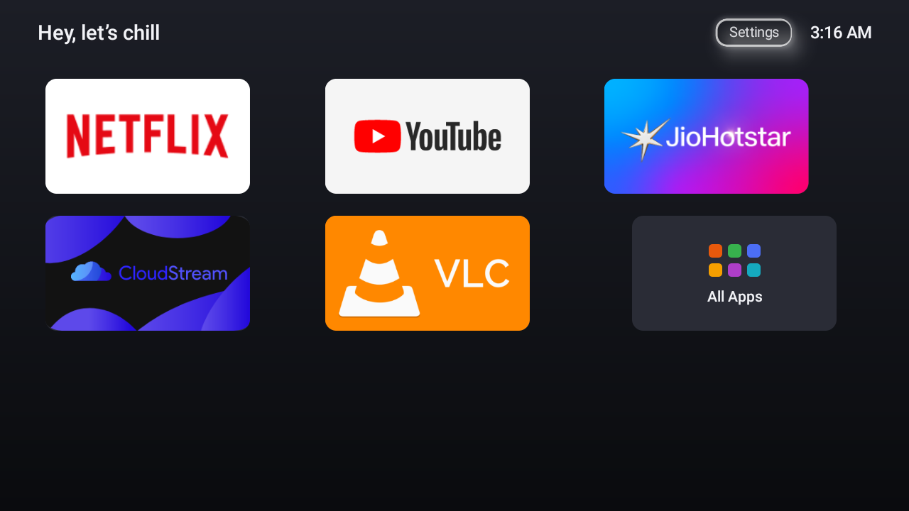
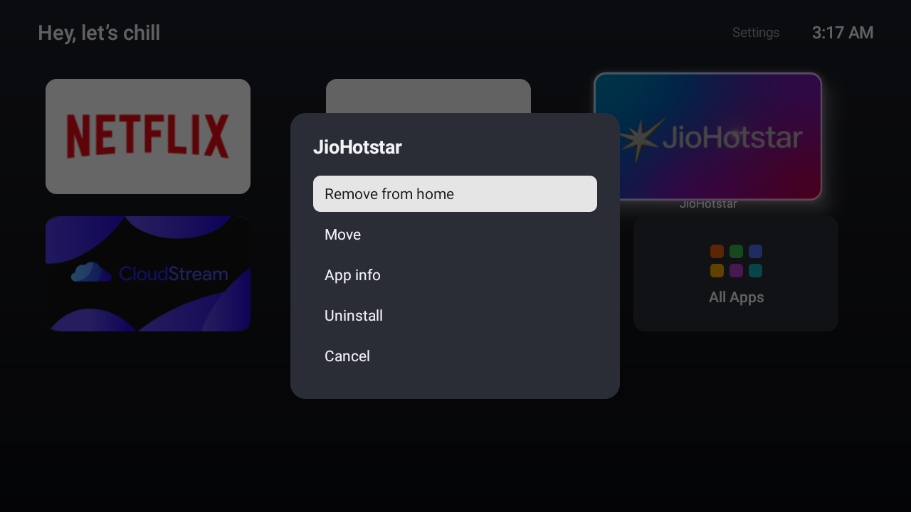
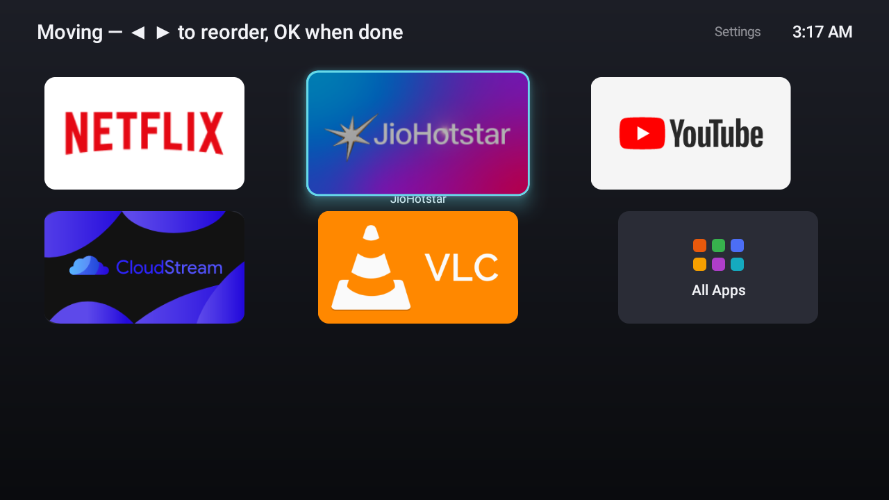

# Chill 🛋️ — de-bloat + a tiny tvOS-style launcher for budget Android TVs

Your cheap Android TV shows you ads on its own home screen, tracks what you
watch, and still manages to feel slow. This repo fixes all three — **without
root, fully reversibly, using nothing but `adb` over Wi-Fi**.

It was built for a Realme/Changhong 32" TV (DVB91RM, Android TV 11, 1 GB RAM,
armv7) but the approach works on most Android TVs; only the package list needs
auditing per model.

| | |
|---|---|
|  |  |
| The home screen: only the apps you chose | Hold OK: add/remove/move/uninstall |

## Why this is the right way to do it

There are three ways to fix a bloated Android TV, and two of them are bad:

1. **Rooting / custom ROMs** — real risk of bricking a device that often has no
   recovery images available, voids warranty, and is simply unnecessary for
   this goal.
2. **Installing a launcher app from the Play Store** — Android TV pins the
   stock launcher as the HOME handler, so a store launcher either can't become
   the default at all, or nags forever. Most are also heavy, ad-funded, or
   subscription-ware — on a 1 GB RAM TV they make things *worse*.
3. **This repo's approach** — use `adb` (a supported, first-party Android tool)
   to:
   - remove bloat with `pm uninstall -k --user 0`, which only removes the app
     *for the current user*. **The APK physically stays on the read-only system
     partition**, so every single removal is reversible with one command
     (`restore.sh` does it for you), no warranty is touched, and firmware
     updates keep working;
   - disable (not delete) the stock ad-launcher, which makes the custom
     launcher the only HOME handler — the one reliable way to change the
     default launcher on Android TV;
   - install a purpose-built ~800 KB launcher with zero ads, zero telemetry,
     zero network access, that cold-starts in ~2 s on 1 GB RAM.

The worst-case rollback story: run `restore.sh`, and the TV is byte-for-byte
back to stock behavior. That's the whole reason this design was chosen.

## What removing the bloat actually gets you

From the audit of this TV (see [`tv-audit/audit.md`](tv-audit/audit.md)):

- `com.google.android.tvrecommendations` + partner customizer — **the ads and
  "sponsored" rows** on the stock home screen.
- `tv.anoki.acr.controller` — **ACR: watches what's on your screen and phones
  home.** This alone is worth the exercise.
- A dozen OEM apps (store, screen-share ×2, file explorer, help, "AI"
  service…) idling in the background of a device with ~90 MB free RAM.

## What's in the repo

```
tv-audit/    The audit: every package classified REMOVE / KEEP / NEVER TOUCH
debloat/     debloat.sh (safe to re-run anytime) + restore.sh (full undo)
launcher/    "Chill" — the launcher, Kotlin + Jetpack Compose, minSdk 26
screenshots/
```

## The launcher

- **tvOS-style UI** — dark gradient, big rounded banner cards, springy focus
  scale with a soft glow, app labels fade in under the focused card, clock in
  the corner.
- **A home screen you curate** — only the apps you picked, in your order.
  Everything else lives behind an *All Apps* card.
- **Hold OK on any card** → menu: add/remove from home, **Move** (reorder with
  ◀ ▶, animated), app info, uninstall. Works on remotes that never send
  key-repeat events (a real-world d-pad quirk that breaks Compose's built-in
  long-press).
- **USB drive aware** — plug in a pendrive and a "USB Drive" card appears,
  opening your video player (VLC) to browse it. Unplug it, card's gone.
- **Fast on weak hardware** — app art is disk-cached so a cold start renders
  instantly instead of re-reading banners out of ~20 APKs; focus animations run
  entirely on the GPU layer; release build is minified to ~800 KB.
- **No permissions worth worrying about** — no internet permission, no
  analytics, nothing. Read the source over a coffee; it's three Kotlin files.



## Requirements

- A computer with [`adb`](https://developer.android.com/tools/adb) (`brew
  install android-platform-tools` / `apt install adb`).
- TV with **network debugging enabled** (Settings → Device Preferences → About
  → tap *Build* 7× → Developer options → Network debugging).
- To build the launcher: JDK 17+ and the Android SDK (or grab a prebuilt APK
  from Releases if available).

## Quick start

**1. Connect** (TV and computer on the same network):

```bash
adb connect <TV_IP>:5555   # accept the prompt on the TV
```

**2. Audit — do not skip this on a different TV model.** The package list in
`debloat.sh` was audited for *this* TV. Dump yours and compare:

```bash
adb shell pm list packages -f > my-packages.txt
```

Anything you don't recognize: look it up before touching it. Keep the
[`NEVER TOUCH` list](tv-audit/audit.md) sacred — chipset services
(`com.mediatek.*`), Play services, WebView, keyboard, setup and OTA packages.

**3. De-bloat:**

```bash
cd debloat && ./debloat.sh <TV_IP>
```

Idempotent — run it again after every firmware update. Regret something?
`./restore.sh <TV_IP>` brings everything back.

**4. Install the launcher and make it home:**

```bash
cd launcher && ./gradlew assembleRelease
adb install -r app/build/outputs/apk/release/app-release.apk
adb shell am start -n com.tarun.pontlauncher/.MainActivity   # check it opens
adb shell pm disable-user --user 0 com.google.android.tvlauncher
```

Press HOME — you're in Chill. (The release build is deliberately debug-signed:
it's a sideloaded personal build, and this keeps `adb install -r` upgrades
painless.)

**Undo the launcher:**

```bash
adb shell pm enable com.google.android.tvlauncher
adb uninstall com.tarun.pontlauncher
```

## What survives what

| Event | Debloat | Launcher + your home layout |
|---|---|---|
| Reboot / power cut | ✅ | ✅ (TV boots straight into it) |
| App updates | ✅ | ✅ |
| Firmware (OTA) update | ⚠️ may partially revert — re-run `debloat.sh` | ✅ app survives; stock launcher may need re-disabling |
| Factory reset | ❌ | ❌ (reinstall — 2 minutes) |

## Customizing

- Default home apps: `DEFAULT_CANDIDATES` in
  [`launcher/app/src/main/java/com/tarun/pontlauncher/Apps.kt`](launcher/app/src/main/java/com/tarun/pontlauncher/Apps.kt)
  (used only on first run — after that you curate from the UI).
- Colors, greeting text, card sizes: top of
  [`LauncherScreen.kt`](launcher/app/src/main/java/com/tarun/pontlauncher/LauncherScreen.kt).
- USB card's target player: `openUsb()` in
  [`MainActivity.kt`](launcher/app/src/main/java/com/tarun/pontlauncher/MainActivity.kt).

## Disclaimer

The package lists are specific to the audited model. Removing system packages
you don't understand can break things — that's why everything here is
user-scoped and reversible, and why the audit file exists. Read it, adapt it,
and keep `restore.sh` handy. Not affiliated with Realme, Changhong, or Google.

## License

[MIT](LICENSE)
